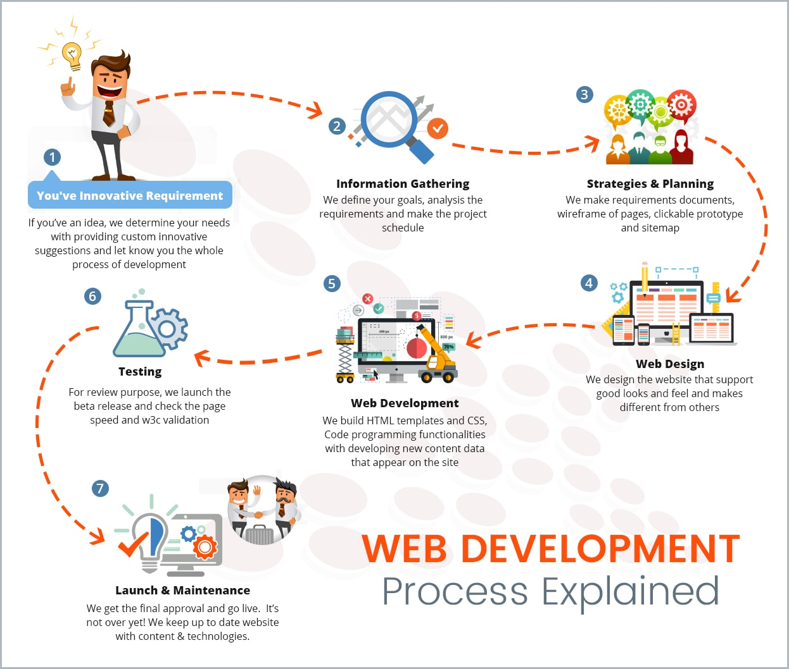

# Htmal & Java sc

# What is HTML?
* HTML stands for Hyper Text Markup Language
* HTML is the standard markup language for creating Web pages
* HTML describes the structure of a Web page
* HTML consists of a series of elements
* HTML elements tell the browser how to display the content
* HTML elements label pieces of content such as "this is a heading", "this is a paragraph", "this is a link", etc.

 # Markup
*HTML is “HyperText Markup Language”.*
## The HyperText part allows you to create links that allow visitors to move from one page to another uickly and easily.
## A markup language allows you to annotate texts that provide additional meaning to the contents of a document.
## HTML pages are text documents.

## A markup language is
 ### a computer language that uses tags to define elements within a document. It is human-readable, meaning markup files contain standard words, rather than typical programming syntax. While several markup languages exist, the two most popular are HTML and XML.

# Extra Markup
##  Tag	&  description 

* < !DOCTYPE HTML >  :	as we mentioned before for HTML5 coding |
* < !-- comment -- > :	for comment it will not appear in web page it's for coding just
* < character id="text" > :	the bold italic sentence for giving for tag an id and call it when need that by hash tag sign (#)
* < character class="text" >:	the bold italic sentence for giving for tag a class and call it when need that by dote sign (.)
* < div > : for group of elements in a block
* < span > :	for group of element in a inline
* < iframe > :	to open another website in same website that you make
* There are a block statement tage thats mean it will take the page in separate line like
tag, on the other hand we have inline statment tag it appears in the same line of other inline tages like < b > tag.

* escape charater 

# HTML Layout Elements
HTML has several semantic elements that define the different parts of a web page:
1. <header> - Defines a header for a document or a section
2. <nav> - Defines a set of navigation links
3. <section> - Defines a section in a document
4. <article> - Defines an independent, self-contained content
5. <aside> - Defines content aside from the content (like a sidebar)
6. <footer> - Defines a footer for a document or a section
7. 
 - Defines additional details that the user can open and close on demand
8. 
 - Defines a heading for the 
 element

# process design 
 **steps to design a website requires 7 steps:**

1. Goal identification: Where I work with the client to determine what goals the new website needs to fulfill. I.e., what its purpose is.
2. Scope definition: Once we know the site's goals, we can define the scope of the project. I.e., what web pages and features the site requires to fulfill the goal, and the timeline for building those out.
3. Sitemap and wireframe creation: With the scope well-defined, we can start digging into the sitemap, defining how the content and features we defined in scope definition will interrelate.
4. Content creation: Now that we have a bigger picture of the site in mind, we can start creating content for the individual pages, always keeping search engine optimization (SEO) in mind to help keep pages focused on a single topic. It's vital that you have real content to work with for our next stage:
5. Visual elements: With the site architecture and some content in place, we can start working on the visual brand. Depending on the client, this may already be well-defined, but you might also be defining the visual style from the ground up. Tools like style tiles, moodboards, and element collages can help with this process.
6. Testing: By now, you've got all your pages and defined how they display to the site visitor, so it's time to make sure it all works. Combine manual browsing of the site on a variety of devices with automated site crawlers to identify everything from user experience issues to simple broken links.
7.  Launch: Once everything's working beautifully, it's time to plan and execute your site launch! This should include planning both launch timing and communication strategies — i.e., when will you launch and how will you let the world know? After that, it's time to break out the bubbly.

# **THE ABC OF PROGRAMMING**
### Before you learn how to read and write the JavaScript language itself, you need to become familiar with some key concepts in computer programming. They will be covered in three section

* ## A

What is a script and how do I create one?

* ## B

How do computers fit in with the world around them?

* ## C

How do I write a script for a web page?

# **EXPRESSIONS**
**What is a JavaScript Expression?**
## *an expression is a snippet of code that evaluates to a value. A statement is a snippet of code that performs an action. Wherever JavaScript expects a statement, you can write an expression. But the opposite isn't true: if a framework or the JavaScript runtime expects an expression, you cannot use a statement*.

## In JavaScript there are four types of expressions:
In JavaScript there are four types of expressions:
* Assignment expression 

* Arithmetic expression: Expressions in which arithmetic operations are performed arecalled arithmetic expression.Example: netPrice=1200+12
* String expression : Expressions in which operations are performed on string arecalled string expression.Example: mesg= "Hello," + "Mr. Rakesh", Here "+" string operatorconcatenate two strings "Hello, " and "Mr. Rakesh" results "Hello,Mr. Rakesh" that is assigned to variable mesg.

* Logical expression : These expressions evaluate to a Boolean (true or false) value.Example: 10<19, since 10<19, this expression evaluates to theBoolean value of true.
* Assignment expression
