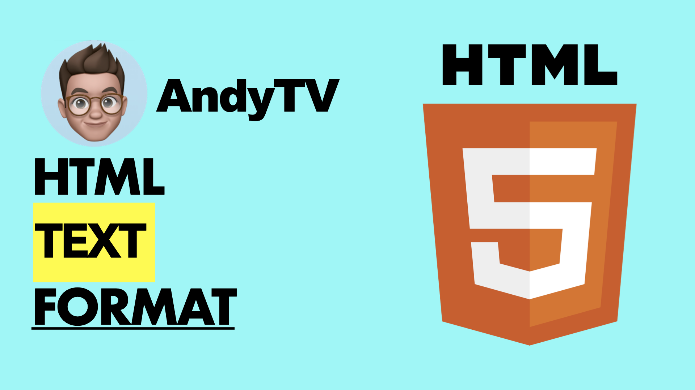
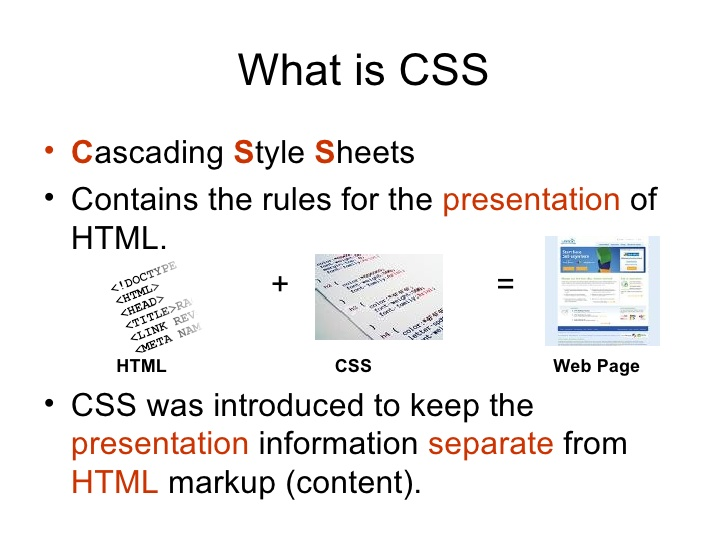

# HTML Text Formatting

## HTML Formatting Elements
*Formatting elements were designed to display special types of text*:

* <b> - Bold text
* <strong> - Important text
* <i> - Italic text
* <em> - Emphasized text
* <mark> - Marked text
* <small> - Smaller text
* <del> - Deleted text
* <ins> - Inserted text
*  - Subscript text
*  - Superscript text

# What is CSS?
1. CSS stands for Cascading Style Sheets
2. CSS describes how HTML elements are to be displayed on screen, paper, or in other media
3. CSS saves a lot of work. It can control the layout of multiple web pages all at once
4. External stylesheets are stored in CSS files

# Why Use CSS?
## CSS is used to define styles for your web pages, including the design, layout and variations in display for different devices and screen sizes.

# JavaScript Programs
A computer program is a list of "instructions" to be "executed" by a computer.

In a programming language, these programming instructions are called statements.

A JavaScript program is a list of programming statements.

# JavaScript Keywords
**JavaScript statements often start with a keyword to identify the JavaScript action to be performed.**
Here is a list of some of the keywords you will learn about in this tutorial 

# JavaScript Loops
## Loops are handy, if you want to run the same code over and over again, each time with a different value.

## Different Kinds of Loops
### JavaScript supports different kinds of loops:

* for - loops through a block of code a number of times
* for/in - loops through the properties of an object
* for/of - loops through the values of an iterable object
* while - loops through a block of code while a specified condition is true
* do/while - also loops through a block of code while a specified condition is true

# The JavaScript Switch Statement
## Use the switch statement to select one of many code blocks to be executed.
