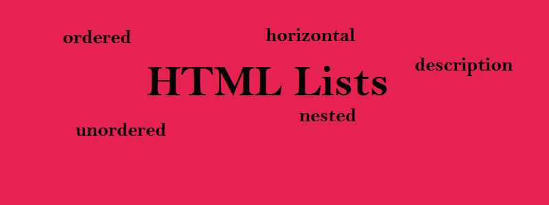
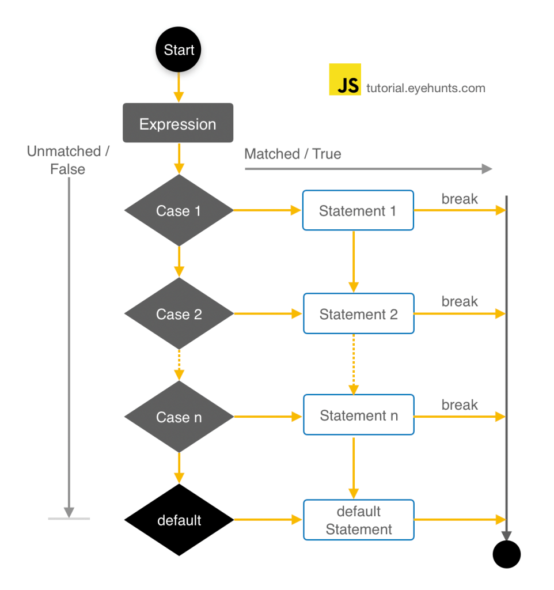

# HTML Lists

## HTML lists allow web developers to group a set of related items in lists.

# Tyeb for list :
* Unordered HTML List
An unordered list starts with the <ul> tag. Each list item starts with the <li> tag.

* Ordered HTML List
An ordered list starts with the <ol> tag. Each list item starts with the <li> tag.

# The CSS Box Model
## All HTML elements can be considered as boxes. In CSS, the term "box model" is used when talking about design and layout.

## The CSS box model is essentially a box that wraps around every HTML element. It consists of: margins, borders, padding, and the actual content. **The image below illustrates the box model**

# Explanation of the different parts:

1. Content - The content of the box, where text and images appear
2. Padding - Clears an area around the content. The padding is transparent
3. Border - A border that goes around the padding and content
4. Margin - Clears an area outside the border. The margin is transparent

# JavaScript Programs
A computer program is a list of "instructions" to be "executed" by a computer.

In a programming language, these programming instructions are called statements.

A JavaScript program is a list of programming statements.

# JavaScript Keywords
**JavaScript statements often start with a keyword to identify the JavaScript action to be performed.**
Here is a list of some of the keywords you will learn about in this tutorial 

# JavaScript Loops
## Loops are handy, if you want to run the same code over and over again, each time with a different value.

## Different Kinds of Loops
### JavaScript supports different kinds of loops:

* for - loops through a block of code a number of times
* for/in - loops through the properties of an object
* for/of - loops through the values of an iterable object
* while - loops through a block of code while a specified condition is true
* do/while - also loops through a block of code while a specified condition is true

# The JavaScript Switch Statement
## Use the switch statement to select one of many code blocks to be executed.
