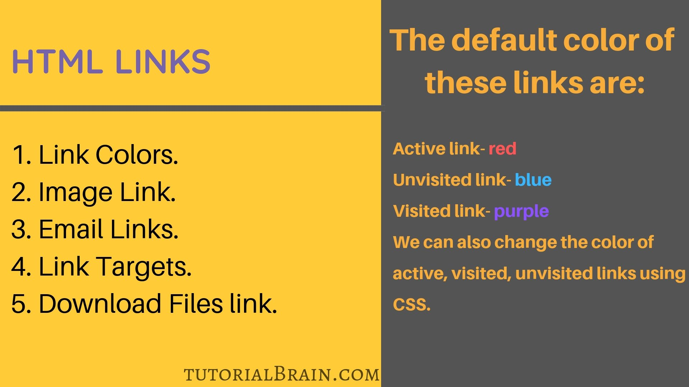
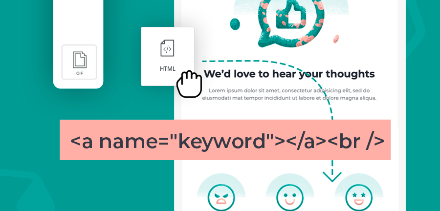
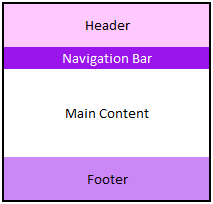
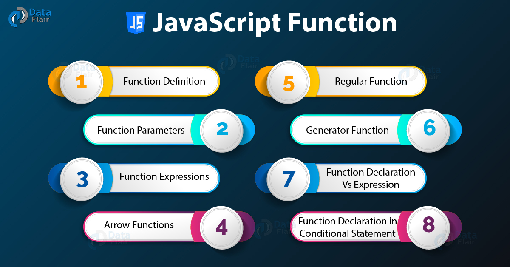
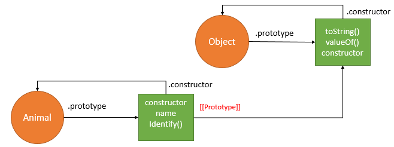
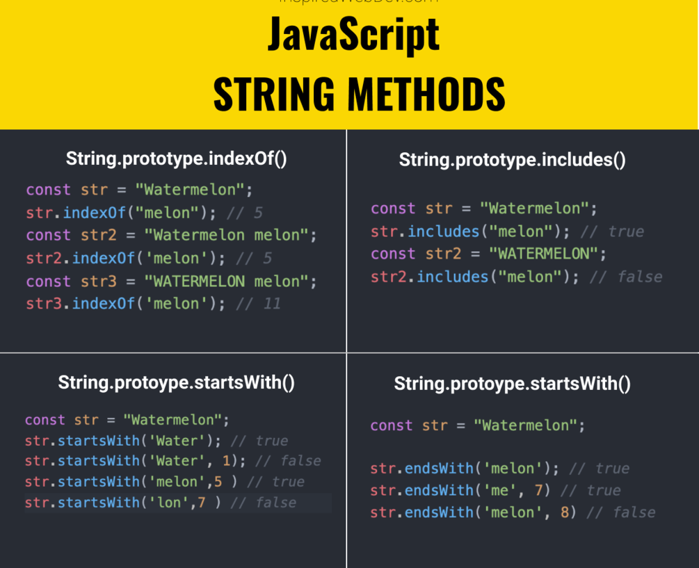

# HTML Links
## Links are found in nearly all web pages. Links allow users to click their way from page to page.

# HTML Links - Hyperlinks
## HTML links are hyperlinks.

## You can click on a link and jump to another document.

## When you move the mouse over a link, the mouse arrow will turn into a little hand.
# HTML Links - Syntax
*The HTML <a> tag defines a hyperlink*

* The most important attribute of the <a> element is the href attribute, which indicates the link's destination.

* The link text is the part that will be visible to the reader.

* Clicking on the link text, will send the reader to the specified URL address.

**By default, links will appear as follows in all browsers:**

1. An unvisited link is underlined and blue
2. A visited link is underlined and purple
3. An active link is underlined and red

# HTML Links - The target Attribute
### By default, the linked page will be displayed in the current browser window. To change this, you must specify another target for the link.

### The target attribute specifies where to open the linked document.

### The target attribute can have one of the following values:

_self - Default. Opens the document in the same window/tab as it was clicked
_blank - Opens the document in a new window or tab
_parent - Opens the document in the parent frame
_top - Opens the document in the full body of the window

# Absolute URLs vs. Relative URLs
* Both examples above are using an absolute URL (a full web address) in the href attribute.

* A local link (a link to a page within the same website) is specified with a relative URL (without the "https://www" part)

# HTML Layout Elements
1. <header> - Defines a header for a document or a section
2. <nav> - Defines a set of navigation links
3. <section> - Defines a section in a document
4. <article> - Defines an independent, self-contained content
5. <aside> - Defines content aside from the content (like a sidebar)
6. <footer> - Defines a footer for a document or a section
7. 
 - Defines additional details that the user can open and close on demand
8. 
 - Defines a heading for the 
 element

# HTML Layout Techniques
*There are four different techniques to create multicolumn layouts. Each technique has its pros and cons:*

* CSS framework
* CSS float property
* CSS flexbox
* CSS grid

# JavaScript Functions
### A JavaScript function is a block of code designed to perform a particular task.

### A JavaScript function is executed when "something" invokes it (calls it).

# JavaScript Function Syntax
A JavaScript function is defined with the function keyword, followed by a name, followed by parentheses ().

Function names can contain letters, digits, underscores, and dollar signs (same rules as variables).

The parentheses may include parameter names separated by commas:
(parameter1, parameter2, ...)

The code to be executed, by the function, is placed inside curly brackets: {}

# Why Functions?
## You can reuse code: Define the code once, and use it many times.

## You can use the same code many times with different arguments, to produce different results.

# JavaScript Objects
### JavaScript variables are containers for data values.

# Object Properties
The name:values pairs in JavaScript objects are called properties:

# The this Keyword
* In a function definition, this refers to the "owner" of the function.

* In the example above, this is the person object that "owns" the fullName function.

* In other words, this.firstName means the firstName property of this object.

# JavaScript Methods
JavaScript methods are actions that can be performed on objects.

A JavaScript method is a property containing a function definition.
