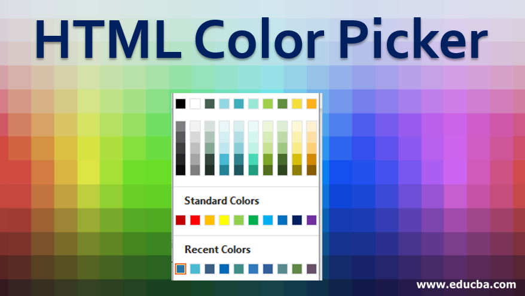

#  Images
## There are many reasons why you might want to add an image to a web page: you might want to include a logo, photograph, illustration, diagram, or chart.
## If you are building a site from scratch, it is good practice to create a folder for all of the images the site uses.

## Images can improve the design and the appearance of a web page.

# Adding Images
## 

# Three Rules for Creating Images
* Save images in the right format
* Save images at the right size
* Use the correct resolution

# HTML Images Syntax
## The HTML  tag is used to embed an image in a web page.

## Images are not technically inserted into a web page; images are linked to web pages. The  tag creates a holding space for the referenced image.

- The  tag is empty, it contains attributes only, and does not have a closing tag.

*The  tag has two required attributes*:

src - Specifies the path to the image
alt - Specifies an alternate text for the image

# Here are the most common image file types, which are supported in all browsers (Chrome, Edge, Firefox, Safari, Opera

# HTML Image Tags

# Color
##  Color can really bring your pages to life.
- background-color
- Color

# Understanding Color
## Every color on a computer screen is created by mixing amounts of red, green, and blue. To find the color you want, you can use a color picker.

# Opacity
## CSS3 introduces the opacity property which allows you to specify the opacity of an element and any of its child elements.

# hsl, hsla

# Text
## Typeface Terminology :
- serif
-sans-serif
-monospace

## Weight, Style, Stretch

# Specifying Typefaces
## font-family

# Size of Type
##  font-size

# Article
##  font-style

# UpperCase & LowerCase
##  text-transform

#  Underline & Strike
##  text-decoration

# Leading
##  line-height

# Letter & Word Spacing
## letter-spacing, word-spacing

# Alignment
##  text-align

# Vertical Alignment
##  vertical-align

# Indenting Text
##  text-indent

# Styling Links
##  :link, :visited

# Responding to Users
## :hover, :active, :focus

