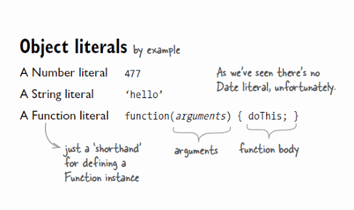

# JavaScript Objects
## Real Life Objects, Properties, and Methods
## In real life, a car is an object.

### A car has properties like weight and color, and methods like start and stop:

### All cars have the same properties, but the property values differ from car to car.

### All cars have the same methods, but the methods are performed at different times.
## The this Keyword
* In a function definition, this refers to the "owner" of the function.

* In the example above, this is the person object that "owns" the fullName function.

* In other words, this.firstName means the firstName property of this object.

# The HTML DOM (Document Object Model)
- When a web page is loaded, the browser creates a Document Object Model of the page.

- The HTML DOM model is constructed as a tree of Objects:

# With the object model, JavaScript gets all the power it needs to create dynamic HTML:

* JavaScript can change all the HTML elements in the page
* JavaScript can change all the HTML attributes in the page
* JavaScript can change all the CSS styles in the page
* JavaScript can remove existing HTML elements and attributes
* JavaScript can add new HTML elements and attributes
* JavaScript can react to all existing HTML events in the page
* JavaScript can create new HTML events in the page

# What is the DOM?
## The DOM is a W3C (World Wide Web Consortium) standard.

## The DOM defines a standard for accessing documents:

*"The W3C Document Object Model (DOM) is a platform and language-neutral interface that allows programs and scripts to dynamically access and update the content, structure, and style of a document."*

### The W3C DOM standard is separated into 3 different parts:

- Core DOM - standard model for all document types
- XML DOM - standard model for XML documents
- HTML DOM - standard model for HTML documents

# What is the HTML DOM?
### The HTML DOM is a standard object model and programming interface for HTML. It defines:

* The HTML elements as objects
* The properties of all HTML elements
* The methods to access all HTML elements
* The events for all HTML elements
- In other words: The HTML DOM is a standard for how to get, change, add, or delete HTML elements.

